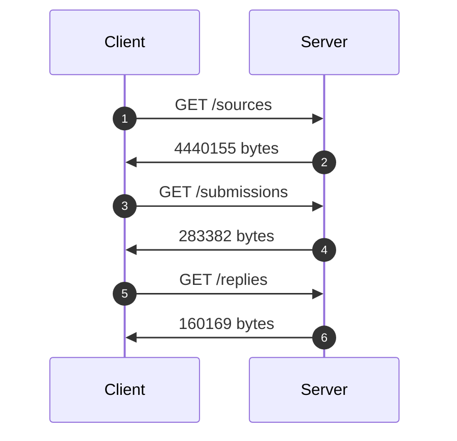
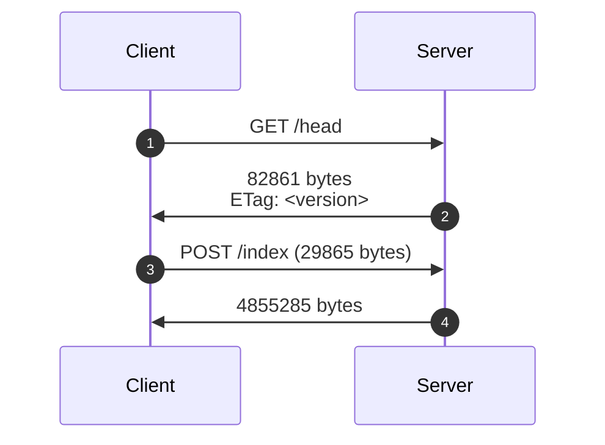
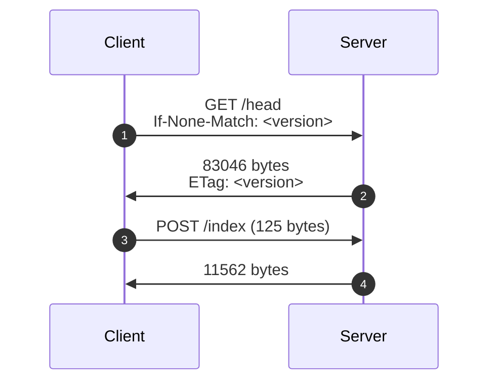
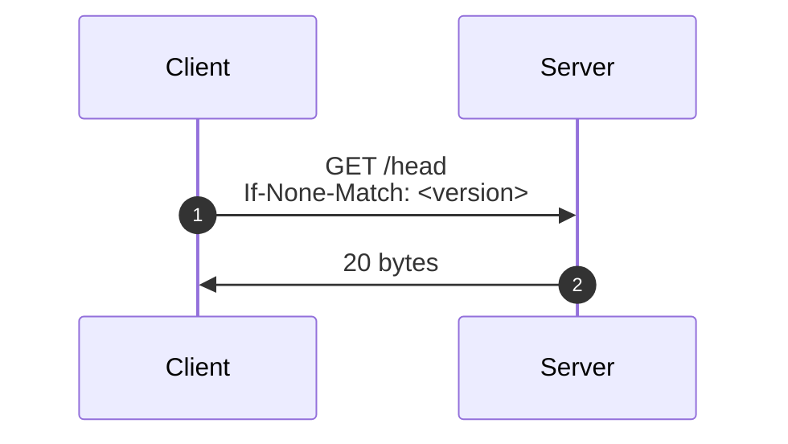

## Goals

1. Generalize indexing, versioning, and fetching across entities (API endpoints
   over database models).
2. Favor strict equality checks (between global and resource-level versions)
   over pagination or cursors.
3. Minimize both round trips and data cost over Tor.
4. Optimize for the steady state where there's nothing to do.
5. Make only non-breaking additions to the Journalist API and ORM layer.
   1. Corollary: Make no changes to the database models (schema) or application
      logic.

## Non-goals / out of scope

1. This is not production-quality code: I iterated by hand on the Journalist API
   to provide the interface I wanted. ChatGPT iterated on `sync_client.py` to
   demonstrate the properties I wanted.
2. This does not discuss or demonstrate downloading `Submission`/`Reply` blobs,
   since these are strictly throughput-limited.
3. This does not minimize CPU cost—although I demonstrate some caching here, and
   more optimization is possible.

## Proof of concept

You can run `sync_client.py` against `make dev` (or the `SD_JOURNALIST_API`
hostname of your choice) with the following patch to disable the Journalist
API's token authentication:

```patch
--- a/securedrop/journalist_app/__init__.py
+++ b/securedrop/journalist_app/__init__.py
@@ -129,8 +129,7 @@ def create_app(config: SecureDropConfig) -> Flask:
             app.logger.error("Site logo not found.")

         if request.path.split("/")[1] == "api":
-            if request.endpoint not in _insecure_api_views and not session.logged_in():
-                abort(403)
+            pass
```

```sh-session
$ python sync_client.py -h
usage: sync_client.py [-h] [--prefix PREFIX] [-v]

options:
  -h, --help       show this help message and exit
  --prefix PREFIX  Group source UUIDs by prefix of given length
  -v, --verbose    Enable debug logging
```

## Overview and benchmarks

Initial data on server:

| Entity      | Count                     |
| ----------- | ------------------------- |
| Source      | 1362                      |
| Submissions | 4/source = 5448 (approx.) |
| Replies     | 2/source = 2724 (approx.) |

In the measurements below, bytes are counted compressed[^1], and times are over Tor.

### Status quo: naïve fetch

Every time, no matter what has or hasn't changed, the Client asks the Server for
the metadata about (1–2) _all_ sources, (3–4) _all_ submissions, and (5–6) _all_
replies:



|         | Data    | Time      |
| ------- | ------- | --------- |
| Total   | 4.88 MB | 49.34 sec |
| Speedup | 1.00    | 1.00      |

### Proposal: Hash-based versioning

#### Initial fetch

When we run for the first time:

1. Tell the Server what we have: nothing.
2. The server enumerates its current _index_: the UUIDs and versions (hashes) of
   all source metadata, plus the current global version in the [`ETag`
   header][etag].
   - Each source's metadata includes a `collection_version` property over its
     `collection` of submissions and replies, also enumerated by UUID and
     version.
3. Ask the server for what we're missing: everything.
4. The server returns the metadata for all sources and their _collections_
   (submissions and replies).

[etag]: https://developer.mozilla.org/en-US/docs/Web/HTTP/Reference/Headers/ETag



|         | Data    | Time      |
| ------- | ------- | --------- |
| Total   | 4.97 MB | 70.85 sec |
| Speedup | 0.98    | 0.69      |

#### Something's changed

If _any_ server-side state has changed, whether from a source or journalist (or
via `loaddata.py`):

1. Tell the Server what we have: some _version_, which is the SHA-256 hash of
   our own _index_.
2. The server enumerates its current _index_: it has a different _version_, so
   it sends us the entire _index_.
3. Ask the server for what we're missing: here, it's 3 new sources.
4. The server returns the metadata for just those sources and their
   _collections_.



##### Cache miss: server has to recalculate index

|         | Data    | Time      |
| ------- | ------- | --------- |
| Total   | 0.08 MB | 29.23 sec |
| Speedup | 61.00   | 1.68      |

##### Cache hit: server returns cached version

As prototyped here, the cache is invalidated:

- after inserting, updating, or deleting any `Source`, `Submission`, or `Reply`;
  or
- after 1 hour.

|         | Data    | Time          |
| ------- | ------- | ------------- |
| Total   | 0.08 MB | **18.38** sec |
| Speedup | 61.00   | **2.68**      |

#### Steady state

Next time, and in fact _most_ times, we get lucky:

1. Tell the Server what we have: again, the _version_ of our current _index_.
2. The Server's current _index_ has the same _version_, so it returns HTTP
   `304`: not modified.



|         | Data     | Time     |
| ------- | -------- | -------- |
| Total   | 20 bytes | 0.66 sec |
| Speedup | 244,000  | 74.76    |

## Implementation suggestions

### Persistence

In the Client, persist the JSON-format metadata directly to SQLite, without
further de/serialization apart from [JSON-schema validation][JSON Schema]. I've been
accumulating the hypothesis that this will be the easiest way to consume the
Journalist API's JSON responses from a JavaScript/TypeScript app anyway, and
this week @legoktm sent me a [testimonial to this
approach](https://crawshaw.io/blog/programming-with-agents) (see the section
beginning "Example: SQL conventions around JSON").

[JSON Schema]: https://json-schema.org/overview/what-is-jsonschema

### Limiting response sizes[^2]

This proposal seeks to avoid (a) timestamped-based cursors, which are
challenging to implement robustly for all our queries of interest[^3]; and (b)
pagination, which introduces new state to track during a given sync iteration.

However, let's consider each of these strategies to be a form of sharding.
Cursors shard across timestamps, and pagination shards over the size of the
collection. What else can we shard? One option is the `Source.uuid` field,
which should be uniformly distributed:

```sh-session
$ python sync_client.py --prefix 0
: 1368
$ python sync_client.py --prefix 1
0: 80
1: 85
2: 95
3: 76
4: 79
5: 89
6: 85
7: 77
8: 80
9: 90
a: 93
b: 90
c: 94
d: 88
e: 80
f: 87
```

This suggests a future refinement of this sync strategy:

1. `/head`: Server returns a version per shard.
2. Client determines which of its shards are out of date.
3. `/index`: Client requests updated indexes for just those shards.

> [!NOTE]
> For synchronizing a more heterogeneous collection (with many types, arbitrary
> schemas, etc.), this approach basically generalizes to a Merkle tree, at least
> within each shard. That generalization has some advantages; in particular, it
> would lay the groundwork for peer-to-peer sync among Workstations using the
> SecureDrop Protocol, where the server is only a message queue. But that would be
> overengineered for this "v2" sync strategy, where we can count on a fixed
> two-level hierarchy between sources and their collections.

### Client-to-Server writes

The Journalist API currently accepts the following writes from clients:

| Resource            | Verb         |
| ------------------- | ------------ |
| Source (account)    | `DELETE`[^4] |
| Source conversation | `DELETE`     |
| Star                | `POST`       |
| Star                | `DELETE`     |
| Reply               | `POST`       |
| "Seen" record       | `POST`       |

Instead of maintaining a "job queue" of Client-side writes—and having to retry
and reconcile them—make them blocking. For example, block the Client on starring
a new source until the Server accepts it; block the Client until a new reply has
been sent; etc. Keeping user-initiated actions synchronous will eliminate both
technical and UX complexity.

If the UX we want requires asynchronous writes, we could try accumulating them
in the client and then batching them _into_ the sync request, e.g.:

```json
{
   "sources": [],  # to update during fetch
   "changes":
   [
      {"event_uuid": "<uuid>", "event_type": "source_starred", "source_uuid": "<uuid>"},
      {"event_uuid": "<uuid>", "event_type": "source_deleted", "source_uuid": "<uuid>"},
      {"event_uuid": "<uuid>", "event_type": "reply_sent", ...}
   ]
}
```

Then the server's response can include both (a) the updated index after these
changes and (b) the UUIDs of which events have been accepted or rejected.
(Server wins; client loses.)

## See also

- [securedrop#7498] laid the groundwork for this proposal.
- [RFC 3229 "Delta Encoding in HTTP"][RFC 3229] specifies a protocol by which
  (a) a client tells a server what version of a resource it currently has cached
  and (b) the server returns a byte-level patch from the cached version to the
  latest version. It requires that the server either cache or compute previous
  versions in order to compute patches based on them.
- [RFCs 6902 "JavaScript Object Notation Patch"][RFC 6902] and [7386 "JSON Merge
  Patch"][RFC 7386] specify conventions by which a client can send a server a
  partial update to a resource in JSON format. They offer no mechanism for
  partial updates from a server to a client.
- [GraphQL] would enable richer query semantics but doesn't offer any
  versioning, diffing, or syncing mechanisms. (The ones I've proposed here could
  be adapted to GraphQL but at higher bandwidth cost.) It's worth looking into
  from the Client front end to the back end but probably not from the Client back
  end to the Server.

[GraphQL]: https://en.wikipedia.org/wiki/GraphQL
[RFC 3229]: https://datatracker.ietf.org/doc/html/rfc3229
[RFC 6902]: https://datatracker.ietf.org/doc/html/rfc6902
[RFC 7386]: https://datatracker.ietf.org/doc/html/rfc7386
[securedrop#7498]: https://github.com/freedomofpress/securedrop/issues/7498#issuecomment-2843748418

[^1]:
    Since `requests` automatically decompresses the incoming response, we
    manually recompress it via `gzip` and take the length.

[^2]:
    From the Journalist API. The Electron back end is of course free to
    paginate data for lazy loading by the front end, including via something
    fancy like [GraphQL]!

[^3]: https://github.com/freedomofpress/securedrop-client/issues/2462#issuecomment-2967492447
[^4]:
    A mechanism for bulk deletion is proposed in
    <https://github.com/freedomofpress/securedrop/pull/7228>.
