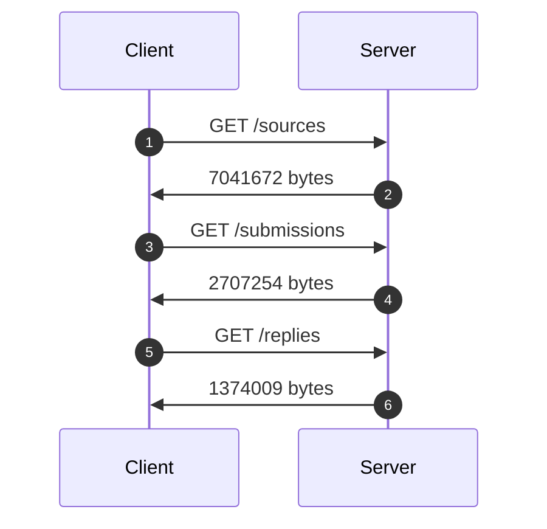
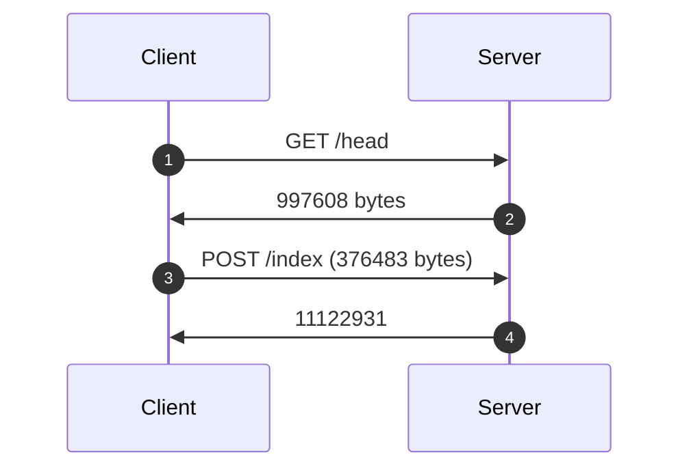
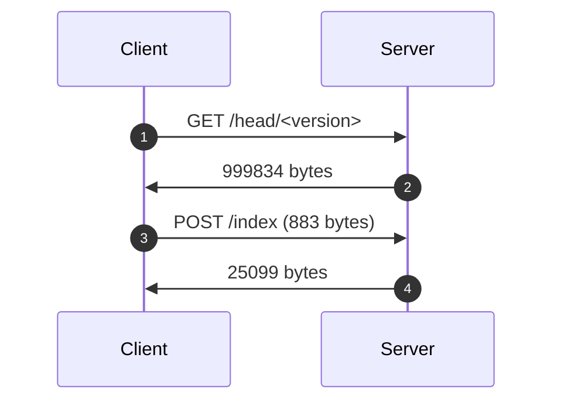
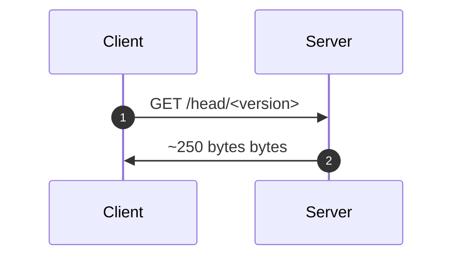

## Goals

1. Generalize indexing, versioning, and fetching across entities (API endpoints
   over database models).
2. Favor strict equality checks (between global and resource-level versions)
   over pagination or cursors.
3. Minimize both round trips and data cost over Tor.
4. Optimize for the steady state where there's nothing to do.
5. Make only non-breaking additions to the Journalist API and ORM layer.
   1. Corollary: Make no changes to the database models (schema) or application
      logic.

## Non-goals / out of scope

1. This is not production-quality code: I iterated by hand on the Journalist API
   to provide the interface I wanted. ChatGPT iterated on `sync_client.py` to
   demonstrate the properties I wanted.
2. This does not discuss or demonstrate downloading `Submission`/`Reply` blobs,
   since these are strictly throughput-limited.
3. This does not minimize CPU cost—although I demonstrate some caching here, and
   more optimization is possible.

## Overview and benchmarks[^1]

Initial data on server:

| Entity      | Count |
| ----------- | ----- |
| Source      | 1347  |
| Submissions | 5380  |
| Replies     | 2684  |

[^1]:
    My test transcripts, in need of some clean-up, are in
    <https://pad.riseup.net/p/iwpOKj8jUgVy3OhVmJic>.

### Status quo: naïve fetch

Every time, no matter what has or hasn't changed, the Client asks the Server for
the metadata about (1–2) _all_ sources, (3–4) _all_ submissions, and (5–6) _all_
replies:

|         | Data     | Time      |
| ------- | -------- | --------- |
| Total   | 11.12 MB | 32.65 sec |
| Speedup | 1.00     | 1.00      |

### Proposal: Hash-based versioning

#### Initial fetch

When we run for the first time:

1. Tell the Server what we have: nothing.
2. The server enumerates its current _index_: the UUIDs and versions (hashes) of
   all sources, submissions, and replies.
3. Ask the server for what we're missing: everything.
4. The server returns the metadata for all sources, submissions, and replies.

|         | Data     | Time      |
| ------- | -------- | --------- |
| Total   | 12.50 MB | 56.10 sec |
| Speedup | 0.89     | 0.58      |

#### Something's changed

If _any_ server-side state has changed, whether from a source or journalist (or
via `loaddata.py`):

1. Tell the Server what we have: some _version_, which is the SHA-256 hash of
   our own _index_.
2. The server enumerates its current _index_: it has a different _version_, so
   it sends us the entire _index_.
3. Ask the server for what we're missing: here, it's 3 new sources and their
   submissions and replies.
4. The server returns the metadata for just those resources.

|         | Data    | Time      |
| ------- | ------- | --------- |
| Total   | 1.03 MB | 30.65 sec |
| Speedup | 10.80   | 1.06      |

#### Steady state

Next time, and in fact _most_ times, we get lucky:

1. Tell the Server what we have: again, the _version_ of our current _index_.
2. The Server's current _index_ has the same _version_, so it returns HTTP
   `304`: not modified.

|         | Data       | Time     |
| ------- | ---------- | -------- |
| Total   | ~250 bytes | 0.59 sec |
| Speedup | ~44,480    | 55.34    |

## Implementation suggestions

1. In the Client, persist the JSON-format metadata directly to SQLite, without
   further de/serialization. I've been accumulating the hypothesis that this will
   be the easiest way to consume the Journalist API's JSON responses from a
   JavaScript/TypeScript app anyway, and this week @legoktm sent me a
   [testimonial to this
   approach](https://crawshaw.io/blog/programming-with-agents) (see the section
   beginning "Example: SQL conventions around JSON").

2. Instead of maintaining a "job queue" of Client-side writes—and having to
   retry and reconcile them—make them blocking. For example, block the Client on
   starring a new source until the Server accepts it; block the Client until a
   new reply has been sent; etc. Keeping user-initiated actions synchronous will
   eliminate both technical and UX complexity.

## See also

- https://github.com/freedomofpress/securedrop/issues/7498#issuecomment-2843748418
